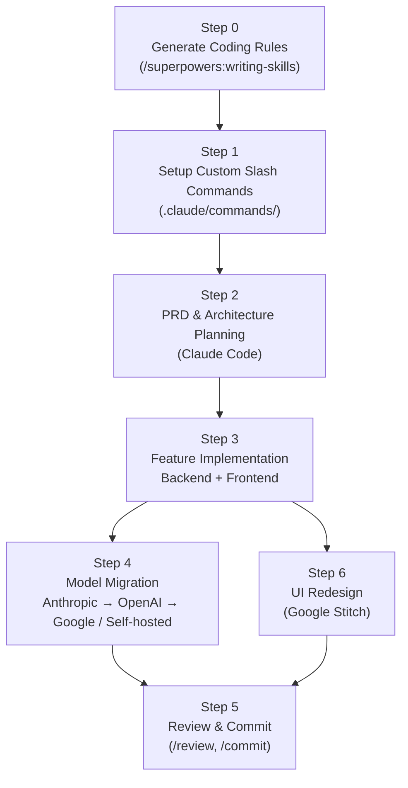

# AI Tools Usage Documentation

This document records how AI tools were used to assist in the development of **Orbitrieve**.

## Development Flow



---

## Tools Used

| Tool | Purpose |
|------|---------|
| [Claude Code](https://claude.ai/code) | Primary development assistant — planning, coding, reviewing, committing |
| [Google Stitch](https://stitch.withgoogle.com/) | UI design refinement and frontend visual adjustments |

---

## Claude Code

### Step 0 — Generate Coding Rules with Superpowers

Before writing any code, the `superpowers:writing-skills` skill was used to generate reusable clean code and architecture rules for the project.

**Prompt:**

```
/superpowers:writing-skills

help me generate a skill about clean code and clean architecture for python and react
```

**Output:** Claude Code generated the rule files now living in `.claude/rules/`:
- `clean-code.md` — naming conventions, function length, comments
- `code-style.md` — ruff / ESLint / Prettier settings
- `error-handling.md` — exception hierarchy, structured API errors
- `logging.md` — structured logging, privacy rules
- `security.md` — secrets, input validation, SSRF, XSS
- `testing.md` — pytest / Vitest conventions, coverage targets

These rules were automatically applied by Claude Code throughout the rest of development.

---

### Step 1 — Setup Custom Slash Commands

A `.claude/commands/` directory was created to define reusable slash commands:

| Command | Prompt file | What it does |
|---------|-------------|--------------|
| `/commit` | [commit.md](.claude/commands/commit.md) | Reads `git diff --cached`, uses a sub-agent to generate a Conventional Commits message with gitmoji, then confirms before committing |
| `/review` | [review.md](.claude/commands/review.md) | Reviews staged diff across 7 categories (correctness, security, type safety, error handling, performance, readability, test coverage) |
| `/refactor` | [refactor.md](.claude/commands/refactor.md) | Refactors selected code for clarity without changing behaviour |
| `/test-gen` | [test-gen.md](.claude/commands/test-gen.md) | Generates pytest / Vitest tests for a given module or component |
| `/security-check` | [security-check.md](.claude/commands/security-check.md) | Audits code for OWASP-style vulnerabilities and secrets exposure |

---

### Step 2 — PRD & Architecture Planning

**Prompt:**

```
請參考作業題目 X：打造一個網路搜尋聊天機器人，
產生 PRD 以及前後端分別的詳細內容
```

Claude Code read the assignment PDF and generated:
- A full Product Requirements Document (PRD)
- Multi-agent architecture design (Orchestrator + Search & Synthesis Agent)
- API contract — request/response shape and SSE event types (`thinking`, `token`, `sources`, `suggestions`, `done`, `error`)
- Tech stack decisions: FastAPI, React 18 + TypeScript, Tavily Search API, Zustand, SSE
- Frontend and backend folder structures
- Development milestones

The output was condensed into [CLAUDE.md](CLAUDE.md) as the project guide.

---

### Step 3 — Feature Implementation

Claude Code implemented the core features iteratively, following the rules from Step 0 and the architecture from Step 2.

**Backend (FastAPI + Agents)**
- FastAPI app scaffold (`app/api`, `app/agents`, `app/services`, `app/core`)
- `OrchestratorAgent` — intent classification, decides search vs. direct answer
- `SearchAgent` — Tavily query, result ranking, citation synthesis
- SSE streaming endpoint (`POST /api/chat`)

**Frontend (React + TypeScript)**
- Components: `MessageList`, `MessageBubble`, `SourceCard`, `SuggestionPills`, `ChatInput`
- Zustand store (`useChatStore`) for chat state
- `useChat` hook — SSE streaming, incremental token updates
- Inline citation rendering with `[1]`, `[2]` markers linked to sources

---

### Step 4 — Model Adjustment (Free Tier Migration)

After the initial implementation using `claude-sonnet-4-6` (Anthropic), the model backend was adjusted to support free-tier or self-hosted alternatives:

**Migration path:**
```
Anthropic (claude-sonnet-4-6)
  → OpenAI-compatible API
    → Google (Gemini) / Self-hosted models (e.g. Qwen3 via Ollama)
```

**Why:** To allow the project to run without paid API credits during development and demo.

Notable change: Added Qwen3 thinking-tag stripping (`<think>...</think>`) in the agent response parser, since self-hosted models sometimes emit chain-of-thought tokens that should not be shown to the user.

---

### Step 5 — Code Review & Commits (Continuous)

`/review` and `/commit` were used after **every change** throughout the entire development process — not as a final phase, but as a continuous loop at each step.

```
/review
```
Claude Code reviewed the staged diff and flagged issues before any commit.

```
/commit
```
Claude Code generated Conventional Commits messages from the staged diff automatically. Example output:

```
feat(agents): ✨ strip Qwen3 thinking tags and harden agent resilience
fix(orchestrator): 🐛 generate follow-up suggestions on direct answers
feat(chat): ✨ add copy-to-clipboard button and fix citation rendering
```

---

## Google Stitch

**URL:** https://stitch.withgoogle.com/

**Prompts (iterative):**

```
1. 打造一個網路搜尋聊天機器人，聊天機器人必需能進行網路搜尋，
   並於回應中標註來源引用，web name 為 Orbitrieve
```

```
2. 只要一個聊天的頁面即可，主色想要偏黃色（暖色系），
   目前畫面如下，但比較陽春
```

```
3. 是不是畫面不需要那麼多功能？因為目前只有聊天而已
```

Stitch generated a warm yellow-toned dark chat UI. After exporting the design, manual adjustments were made:
- Removed unnecessary UI elements that didn't match actual functionality
- Added **copy-to-clipboard** button on assistant messages
- Added **follow-up question suggestions** (SuggestionPills) below each response
- Final styling applied to React components with Claude Code's assistance

---

## Summary

| Step | AI Tool | Prompt / Action | Output |
|------|---------|-----------------|--------|
| 0 | Claude Code (`/superpowers:writing-skills`) | Generate clean code & architecture skill for Python + React | `.claude/rules/*.md` rule files |
| 1 | Claude Code | Define custom slash commands | `.claude/commands/*.md` |
| 2 | Claude Code | PRD from assignment — build a web search chatbot | Architecture, API contract, [CLAUDE.md](CLAUDE.md) |
| 3 | Claude Code | Implement backend agents, SSE, React frontend | Full working application |
| 4 | Claude Code | Migrate model from Anthropic → OpenAI → Google / self-hosted | Free-tier compatible model layer |
| 5 | Claude Code (`/review`, `/commit`) | Review + commit after **every** change (continuous loop) | Clean git history with Conventional Commits |
| 6 | Google Stitch | Redesign UI from light to dark theme | Dark editorial UI applied to React components |

---

## Copyright & Terms of Use

- **Claude Code (Anthropic)** — Used in accordance with [Anthropic's Usage Policy](https://www.anthropic.com/legal/usage-policy). AI-generated code has been reviewed and modified by the developer.
- **Google Stitch** — Used in accordance with [Google's Terms of Service](https://policies.google.com/terms). Generated designs were exported and manually adapted into the project.
- **Tavily Search API** — Search results are used in accordance with [Tavily's Terms of Service](https://tavily.com/terms). Results are surfaced to users with source citations and are not stored or redistributed.
- **Project scope** — This project was developed for academic assignment purposes only and is not intended for commercial use.
